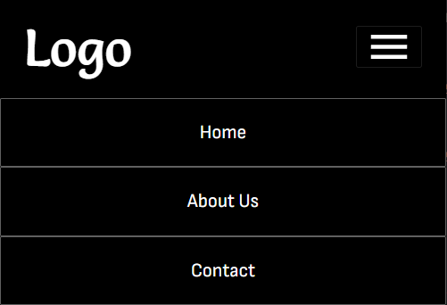

# Responsive Navbar

Simple responsive navbar with a burger menu for smaller devices.

**Burger menu on small devices:**

**Dropdown:**

**Large devices:**

---

# Tasks 📝

### **Task** 1️⃣: Create the Elements for mobile and position them correctly. ✔️✔️

### **Task** 2️⃣: Make the navbar toggle using Javascript.✔️✔️

### **Task** 3️⃣: Change the Elements for their respective Breakpoints.✔️✔️

---

